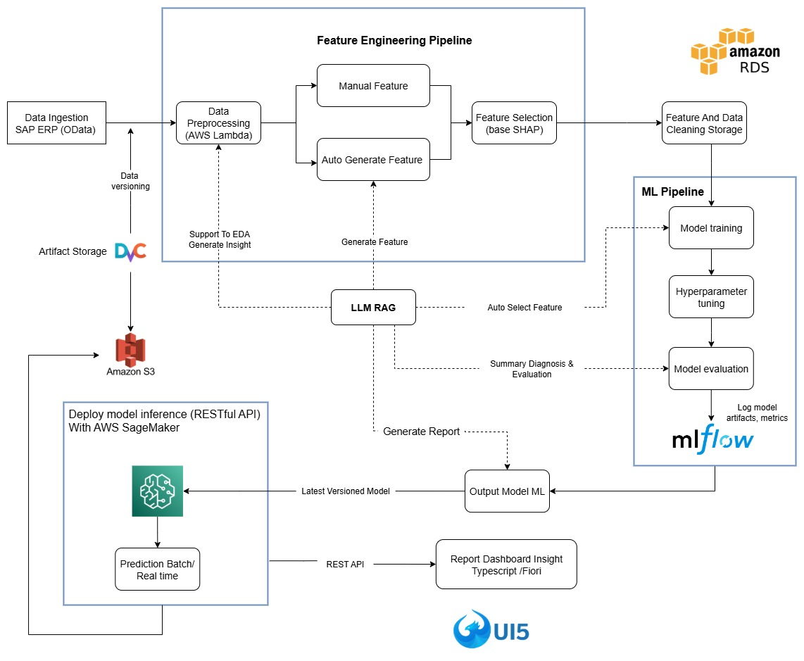

# 6. Forecasting Pipeline

> 
>
> 
<em>Machine Learning Forecasting Pipeline Diagram</em>

The forecasting pipeline is built as a modular, scalable architecture to maximize reusability, flexibility, and robust deployment in production settings.
**Each step below corresponds to a key building block in the end-to-end ML process:**

---

## 1. **Data Ingestion**

- **Objective:** Aggregate data from multiple sources and standardize into a unified schema (typically columns like `ds`, `y`, plus regressors).
- **Why:** Ensures compatibility across models and tools; enables seamless integration with upstream data sources.

---

## 2. **Preprocessing**

- **Objective:** Clean and prepare raw data.
- **Key tasks:** Date format normalization, handling missing values/outliers, adjusting data granularity (e.g., by store, product group).
- **Impact:** Reduces noise, improves model robustness and data quality.

---

## 3. **Feature Engineering**

- **Automated (TSFresh):** Extracts Fourier coefficients, entropy, statistical and temporal features.
- **Manual:** Incorporates business-driven or domain-specific variables.
- **Hybrid (Prophet):** Leverages decomposed trend, seasonality, special event features.
- **LLM-RAG:** Uses generative AI for feature suggestion, automated reports, and advanced diagnostics.

---

## 4. **Feature Selection**

- **Objective:** Identify and retain the most predictive features.
- **Tools:** AutoML routines, SHAP for feature importance, LLM-RAG for diagnostic summaries and data quality checks.

---

## 5. **Model Training**

- **Objective:** Fit the best forecasting model(s) to each data group or cluster.
- **Strategy:** Clustering (e.g., KMeans) assigns time series to groups.

  - **Prophet:** For series with strong trend/seasonality.
  - **XGBoost:** For nonlinear, complex signals.
  - **LightGBM:** For noisy, large-scale or highly variable data.

---

## 6. **Hyperparameter Tuning**

- **Objective:** Find the optimal model hyperparameters.
- **Method:** Leverage Optuna or Grid Search per group/cluster, supports both global and per-model tuning.

---

## 7. **Cross-Validation**

- **Objective:** Robustly estimate generalization error and prevent overfitting.
- **How:** Time series cross-validation splits (respects data order), multiple train/test splits, supports metric-based model selection.

---

## 8. **Model Evaluation**

- **Objective:** Quantify and compare model performance.
- **Metrics:** MAE, RMSE, MAPE, SMAPE, Coverage, etc.
- **Tools:** MLflow logs all metrics, model artifacts, and visualizations.

---

## 9. **Forecast Reconciliation**

- **Objective:** Ensure coherence and consistency in multi-level (hierarchical) forecasts.
- **How:** Use `HierarchicalForecast` with strategies like Bottom-up, Top-down, OLS, MinTrace to enforce aggregation constraints (e.g., system > region > store > SKU).

---

## 10. **Model Diagnosis**

- **Objective:** Monitor training behavior and diagnose issues.
- **Tasks:** Plot learning curves, inspect train/val loss, learning rate schedules, spot overfitting/underfitting, flag anomalies.

---

## 11. **Deployment**

- **Objective:** Serve models for batch or real-time forecasting.
- **Tools:** FastAPI provides REST API endpoints; supports both scheduled jobs and on-demand requests.

---

## 12. **Prediction Output**

- **Deliverables:** Forecasts (`yhat`, `yhat_lower`, `yhat_upper`), actuals (`y`), and time index (`ds`).
- **Usage:** Feeds into planning, downstream systems, and performance evaluation.

---

## 13. **Visualization & Reporting**

- **Objective:** Enable business and technical users to interact with results.
- **Tools:** Streamlit dashboard for trend analysis, forecast vs. actual comparison, error breakdowns, and auto-generated reports.

---

**This modular pipeline enables the system to scale, adapt to changing business requirements, and ensure each step is traceable, testable, and easily maintained.**

---

> _For a visual summary, see the Workflow Diagram above. For deeper technical detail on each module, refer to the [Architecture](architecture.md) and [Feature Engineering](feature_engineering.md) sections._
