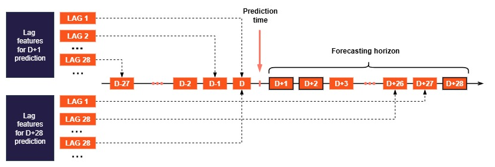

# 3. Feature Engineering
## Business Feature
Business Features are categorical or numeric variables that reflect domain-specific business behaviors, enhancing the model's interpretability and forecasting accuracy. In this project, key Business Features include: 

| Business Feature | Description| Purpose / Impact                                                                                         |
|------------------|------------------------------------------------------------------------------------------------------------------------------------------------------------------|-----------------------------------------------------------------------------------------------------------|
| Wholesale         | Sales from wholesale customers often exhibit high volume but unstable patterns. These transactions may influence retail customer purchasing behavior.           | Captures volatility from wholesale segment; accounts for its effect on more stable retail sales          |
| Visits            | Represents the number of customer visits per day or time unit. Reflects store performance and customer behavior over time.                                      | Helps model demand fluctuation based on shopper volume; supports sales variation and performance analysis |

## Time Feature
Time features are extracted from the date column (ds) to describe calendar-based cycles, seasonality and trends. These features enable the model to capture recurring temporal patterns, such as:

| **Time Feature** | **Description**                                                                 |
|------------------|----------------------------------------------------------------------------------|
| Day of the week  | Monday, Tuesday, etc.                                                           |
| Month of the year| January, February, etc.                                                         |
| Week of the year | Week 1, Week 2, etc.                                                            |
| Holidays         | Tet, Christmas, Black Friday, etc.                                              |
| Fourier coefficients | Encoded periodic patterns in time series using sine and cosine transforms |

## Lag Feature
Lag features are sales values shifted back by a specific time period, derived from past values of the target variable (sales) or related variables. In this project, lag features play a key role in enabling the model to learn autoregressive relationships — a crucial factor in time series forecasting.
However, the value of a lag feature depends on the point in the forecasting horizon you are predicting. For example, sales on day D can be used as:

- 1-day lag when forecasting D+1,
- 2-day lag when forecasting D+2,
- 7-day lag when forecasting D+7,
- 14-day lag when forecasting D+14,
- 28-day lag when forecasting D+28.

## Auto statistic Feature (TSFresh)
Time series features are automatically extracted using the TSFresh library, which generates a wide variety of statistical and signal-based features, including: 

| **Auto statistic Feature (TSFresh)**           | **Description**                                                   |
|----------------------------------|-------------------------------------------------------------------|
| Energy and Entropy               | Measure signal strength and randomness of the time series.        |
| Mean, Variance, Skewness, Kurtosis | Describe central tendency, dispersion, and shape of distribution. |
| Autocorrelation and Partial Autocorrelation | Measure relationships between current and past values.          |