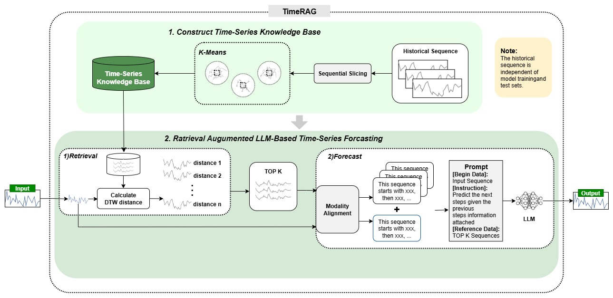

# 4. Model Characteristics

The platform integrates a diverse set of algorithms, enabling robust, scalable, and explainable sales forecasting. Models and strategies are **automatically selected and tuned** based on data characteristics, business requirements, and prediction horizon. Below are the main modeling approaches used in the system:

---

## **A. Unsupervised Clustering: KMeans for Time Series Segmentation**

**KMeans** clustering groups time series with similar patterns, allowing the system to assign the most suitable forecasting model for each group (e.g., XGBoost, Prophet). This tailored approach increases overall accuracy, handles heterogeneity across stores/SKUs, and enables custom strategies at multiple hierarchy levels.

### **Key Features Used for Clustering:**

| **Feature**                               | **Description**                                           |
| ----------------------------------------- | --------------------------------------------------------- |
| Length                                    | Series duration (# periods with data)                     |
| Sparsity                                  | Proportion of zero sales                                  |
| Coefficient of Variation (CV)             | Standard deviation / mean, measuring relative variability |
| Trend Strength                            | Degree and direction of trend over time                   |
| Seasonality                               | Strength of repeating patterns                            |
| Skewness                                  | Asymmetry in distribution                                 |
| Kurtosis                                  | Peakedness, tail heaviness/outlier tendency               |
| Entropy                                   | Randomness or predictability                              |
| Number of Peaks                           | Local maxima count (volatility indicator)                 |
| AFC (Auto-regressive Feature Correlation) | Short-term dependence on previous values                  |
| ACF Mean                                  | Mean autocorrelation at short lags                        |
| Dominant Frequency                        | Main repeating cycle detected                             |
| Rolling Slope                             | Average trend over rolling windows                        |

After clustering, the pipeline automatically assigns and tunes the best model for each group, adapting to changes in data hierarchy or quality.

---

## **B. Core Forecasting Models**

| **Model**    | **Type**                 | **Strengths**                                                                                                     | **Use Case in Retail Forecasting**                                    |
| ------------ | ------------------------ | ----------------------------------------------------------------------------------------------------------------- | --------------------------------------------------------------------- |
| **XGBoost**  | Gradient Boosted Trees   | Handles complex, non-linear tabular data; robust to noise; interpretable; fast training; excellent for short-term | Adapts to store/SKU-specific factors, promotions, sudden changes      |
| **Prophet**  | Decomposable Time Series | Captures trend, seasonality, holiday effects; interpretable components; best for regular, cyclic sales patterns   | Forecasts seasonal demand, marketing/holiday impacts, business cycles |
| **LightGBM** | Fast Boosted Trees       | Optimized for large-scale, high-dimensional, or noisy data; less sensitive to missing patterns                    | Effective for unstable, highly variable multi-store/product data      |

- **Model assignment is automated**: Based on cluster profiles, data diagnostics, and business priorities.

---

## **C. Generative AI: LLM RAG (Retrieval-Augmented Generation)**

**LLM RAG** (Retrieval-Augmented Generation) brings GenAI directly into the forecasting pipeline for complex, highly non-stationary, or outlier-prone time series.

### **How RAG is Used:**

1. **Build a Knowledge Base**:

   - Historical time series are segmented, featurized, and clustered (e.g. KMeans).
   - Representative patterns are stored as a reference database.

2. **Retrieve and Prompt**:

   - For a new input, the system finds the top-K most similar sequences (using DTW, clustering, or embeddings).
   - The input and reference sequences are formatted as a natural language prompt with clear instructions for the LLM.

3. **LLM-Driven Forecasting & Diagnosis**:

   - The LLM uses both input data and retrieved patterns to generate forecasts, detect anomalies, or explain uncertainty.
   - This augments statistical and ML models with external, context-rich knowledge—**without requiring model fine-tuning**.

---

### **Benefits of LLM RAG Integration**

- **Enhances accuracy and stability** for volatile or rare-event time series.
- **Automates feature suggestion and selection** (knowledge-augmented FE).
- **Provides instant diagnostic and explainability reports** for business users and data scientists.
- **Reduces hallucination and adapts across new domains** (no extra retraining).
- **Supports anomaly detection and knowledge-based scenario generation**.

---

**The synergy between classic ML, statistical forecasting, and GenAI makes the system highly flexible, resilient, and future-proof for modern retail operations.**

---
