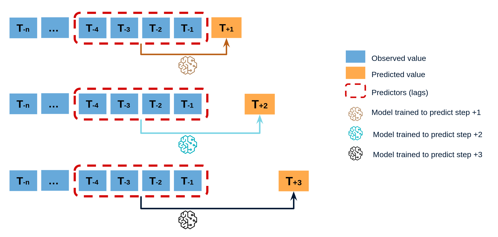
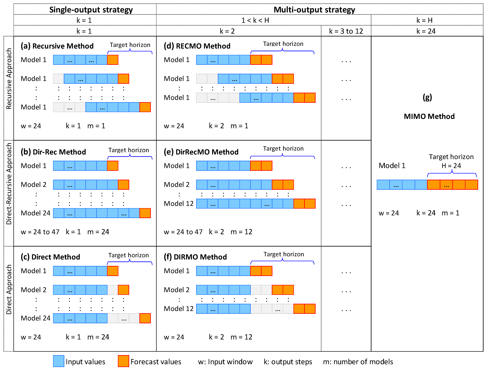
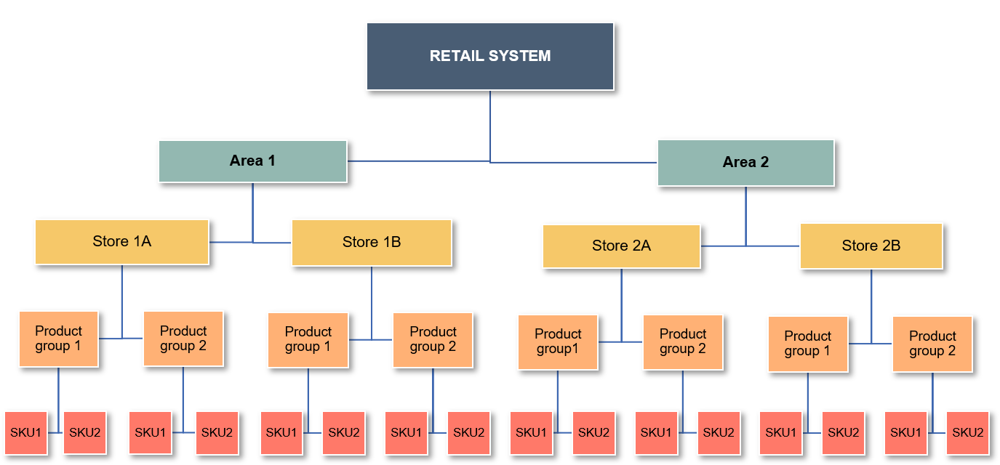

# 7. Strategies

## Multi-Step Forecasting Strategies

> Multi-step forecasting predicts a sequence of future values (e.g., next 7/30 days of sales).  
> There are three core strategies: **Direct**, **Recursive**, and **Hybrid**.

### 1️⃣ Direct Multi-step Forecasting

**Definition:**  
A separate model is trained for each forecast horizon (T+1, T+2, ..., T+H).

!!! tip "Advantages"

    - 🟢 **No error accumulation:** Each step’s forecast is independent.
    - 🛠️ **Step-specific tuning:** Optimize features/model for each horizon.
    - 🎯 **Superior for long horizons:** Accuracy stays high even many steps ahead.

!!! warning "Disadvantages"

    - 🔴 **Complexity:** Needs H models (one per horizon).
    - 💸 **Resource intensive:** More compute, more maintenance.
    - ⚠️ **Framework limitations:** Not all ML libraries support multi-output.



**When to use:**

- You need top accuracy for each future step (e.g., daily business KPIs).
- Have enough data and compute for multi-model training.

---

### 2️⃣ Recursive Multi-step Forecasting

**Definition:**  
Train a single model for one-step-ahead. Predict recursively: use each output as next input.

!!! tip "Advantages"

    - 🟢 **Simplicity:** Only one model to train, deploy, maintain.
    - 🪶 **Lightweight:** Low resource requirements.
    - ⚡ **Fast updates:** Good for rapid retraining.

!!! danger "Disadvantages"

    - 🔴 **Error accumulation:** Mistakes at each step snowball for long horizons.
    - 📉 **Weaker for long-range forecasts:** Accuracy drops the further you predict.


**When to use:**

- Resource-constrained environments.
- Short-term forecasts or when model must update often.

---

### 3️⃣ Hybrid Multi-step Forecasting

**Definition:**  
Combine direct and recursive: e.g., direct for first few steps, recursive after, or ensemble both.

!!! tip "Advantages"

    - 🔄 **Balanced:** Mixes accuracy with efficiency.
    - 🧩 **Flexible:** Can adapt to data/business need.

!!! warning "Disadvantages"

    - 🧑‍🔬 **Complex implementation:** Logic and tuning more involved.
    - 👷 **May need custom code or frameworks.**



**When to use:**

- When horizon is long and you want both accuracy and efficiency.
- Advanced pipelines or high-stakes business planning.

---

### 📊 Strategy Comparison

| Strategy     | Model Count | Error Propagation | Customization | Complexity  | Use Case                      |
| :----------- | :---------- | :---------------- | :------------ | :---------- | :---------------------------- |
| 🟦 Direct    | High        | None              | Per-step      | High        | Max accuracy, long horizon    |
| 🟩 Recursive | Low         | High              | Shared        | Low         | Simplicity, fast iteration    |
| 🟧 Hybrid    | Medium      | Medium            | Mixed         | Medium/High | Best-of-both, advanced setups |

---

> **Tip:**  
> Modern ML pipelines often allow you to choose or ensemble these strategies, so you get the best trade-off for your business case!

## Hierarchical Reconciliation Methods



## Hierarchical Forecast Reconciliation

**Hierarchy:**
Retail System → Area → Store → Product Group → SKU

---

!!! info "What is Forecast Reconciliation?"

    In hierarchical time series forecasting, **reconciliation** means adjusting forecasts so that results at every level are consistent:
    the forecast for a higher level always equals the sum of forecasts at the levels below.

```
This guarantees that all reports and business decisions are based on numbers that "add up"—from total system, to region, to store, to SKU.
```

---

## Why is Reconciliation Needed?

- Prevents inconsistencies between total and detailed (store/SKU) forecasts.
- Ensures all stakeholders (from HQ to stores) can trust and align on the same numbers.
- Avoids planning and reporting confusion caused by non-coherent forecasts.

---

## Core Reconciliation Methods

| Method         | How It Works                                                                 | Advantages                                    | Limitations                                  |
| -------------- | ---------------------------------------------------------------------------- | --------------------------------------------- | -------------------------------------------- |
| **Bottom-up**  | Forecast at the lowest level (SKU), then aggregate up through the hierarchy  | Captures detailed local variation             | Sensitive to local noise and outliers        |
| **Top-down**   | Forecast at the highest level, then allocate down using ratios or rules      | Stable and efficient for total control        | Can miss store/SKU-level patterns and events |
| **Middle-out** | Forecast at a mid-level (e.g., Store), aggregate up and/or disaggregate down | Balances granularity and aggregate accuracy   | Relies on mid-level data quality             |
| **OLS**        | Uses regression to minimize squared differences between levels               | Guarantees sum coherence; interpretable       | Assumes error variance is constant or linear |
| **MinTrace**   | Uses error covariance to minimize total reconciliation variance              | Statistically optimal (lowest total variance) | Computationally more demanding               |

---

## Why Use a Hybrid Approach?

!!! tip "Why Hybrid?"

    - No single method is best for every dataset or business use case.
    - By combining strategies, the system achieves:
    - Consistency from total to lowest level
    - Balance between detail and overall stability
    - Adaptability to the business structure and priorities

The pipeline can dynamically select and tune the reconciliation method each run—often using:

- **Middle-out** as the main approach,
- Enhanced by **Top-down**, **Bottom-up**, and final adjustment using **OLS** and **MinTrace** when needed.

---

## When to Use Each Method

| Strategy                  | How It Works                              | Best Used When                                   |
| ------------------------- | ----------------------------------------- | ------------------------------------------------ |
| Bottom-up                 | Aggregate lowest-level forecasts upward   | Data is detailed and high quality at the bottom  |
| Top-down                  | Split high-level forecasts downward       | Macro-level targets, weaker data at detail level |
| Middle-out                | Start at mid-level, adjust up and down    | Middle tiers are decision-driving                |
| OLS / MinTrace Adjustment | Regression or covariance-based adjustment | Deep hierarchies or strict audit requirements    |
| Hybrid (combined)         | Mix of all above, tuned per run           | Need both granularity and top-level accuracy     |

---

!!! success "Business Impact"

    Accurate, coherent forecasts empower inventory planning, sales targets, and resource allocation.
    Managers at every level—from HQ to store—see numbers that “add up”, driving trust in the system.

---

!!! warning "Considerations"

    - Bottom-up can amplify local noise.
    - Top-down may overlook store or SKU-level changes.
    - OLS/MinTrace adjustments require reliable error estimates for optimal results.

---

## Summary Table

| Method       | Granularity | Coherence | Stability | Complexity | Best For                         |
| ------------ | ----------- | --------- | --------- | ---------- | -------------------------------- |
| Bottom-up    | High        | Yes       | Medium    | Low        | SKU-level or store-level control |
| Top-down     | Low         | Yes       | High      | Low        | Corporate, strategic planning    |
| Middle-out   | Medium      | Yes       | Balanced  | Medium     | Multi-tier organizations         |
| OLS/MinTrace | All         | Yes       | Highest   | High       | Deep hierarchies, compliance     |

---

A **hybrid reconciliation approach** ensures forecasts are accurate, robust, and actionable for every level of your business.

For more details on implementation, see [System Architecture](architecture.md) and [Appendix](appendix.md).
